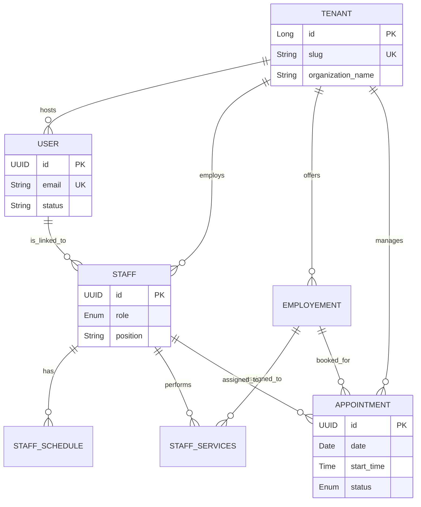

# Multi-Tenant Appointment & Scheduling System

A professional, high-performance backend system built with Spring Boot for managing appointments across multiple independent organizations (tenants).

## 🚀 Key Features

- **Multi-Tenancy**: Data isolation at the database level using `tenant_id` and unique `slug` URL routing.
- **Dynamic Scheduling**: Flexible staff working hours with availability validation.
- **Staff Management**: Role-based access control (Owner, Manager, Staff) for organizational hierarchy.
- **Service Catalog**: Customizable service lists (employments) with duration and pricing.
- **Appointment Lifecycle**: Complete flow from booking/pending to confirmation, completion, or cancellation.
- **Secure Authentication**: JWT-based security with UUID-based user identification.

## 🏗️ System Architecture

The following diagram illustrates the core entity relationships and the multi-tenant structure:



## 🛠️ Technology Stack

- **Framework**: Spring Boot 3+ (Java 25)
- **Database**: PostgreSQL (UUID Primary Keys)
- **Migration**: Flyway
- **Security**: Spring Security & Structured JWT
- **Build Tool**: Gradle
- **Documentation**: Swagger/OpenAPI (Optional)

## 🚦 Getting Started

### Prerequisites
- JDK 21+
- PostgreSQL 15+

### Installation
1. Clone the repository:
   ```bash
   git clone <repository-url>
   ```
2. Configure your database in `src/main/resources/application.yml`.
3. Run the application:
   ```bash
   ./gradlew bootRun
   ```
