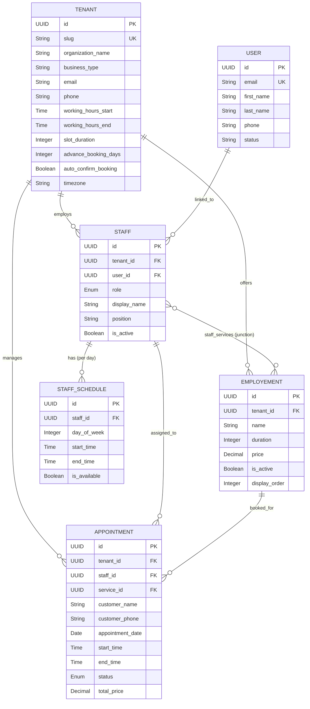

# Multi-Tenant Appointment & Scheduling System

> A professional, production-ready backend system built with **Spring Boot 3** for managing appointments across multiple independent organizations (tenants). Each organization operates in complete isolation — their data, staff, services and appointments never overlap.

---

## 📋 Table of Contents
- [What is this project?](#-what-is-this-project)
- [Key Features](#-key-features)
- [Architecture](#️-architecture)
- [API Overview](#-api-overview)
- [Technology Stack](#️-technology-stack)
- [Supported Business Types](#-supported-business-types)
- [Getting Started](#-getting-started)
- [Project Structure](#-project-structure)

---

## 💡 What is this project?

This system allows **multiple independent organizations** (e.g. barbershops, clinics, beauty salons) to share a single platform while keeping their data **completely isolated**. 

A customer books an appointment at *Style Barbershop* — the system finds available staff slots, blocks the time, and confirms the booking. The barbershop owner manages everything through a dedicated dashboard, while other tenants on the same platform see none of their data.

---

## 🚀 Key Features

| Feature | Description |
|---|---|
| **Multi-Tenancy** | Strict data isolation per tenant via `tenantId` in every URL path |
| **JWT Authentication** | Secure stateless auth with Bearer tokens, stored in localStorage |
| **Role-Based Access** | Three staff roles: `OWNER`, `MANAGER`, `STAFF` |
| **Dynamic Scheduling** | Per-staff weekly schedules with day-of-week availability |
| **Slot Availability** | Real-time free slot calculation based on schedule + existing bookings |
| **Service Catalog** | Services (name, price, duration, image) linked to specific staff members |
| **Appointment Lifecycle** | Full state machine: `PENDING → CONFIRMED → COMPLETED / CANCELLED / NO_SHOW` |
| **Statistics & Calendar** | Revenue stats, staff performance metrics, calendar views |
| **Pagination & Filtering** | All list endpoints support pagination, filtering by status, date range, etc. |
| **Thymeleaf Frontend** | Server-side rendered HTML dashboard for tenant owners |
| **API Documentation** | Swagger UI available at `/swagger-ui.html` |
| **Database Migrations** | Flyway-managed schema versioning |
| **Dockerized** | Ready-to-run Docker image with `Dockerfile` included |
| **Test Coverage** | Unit tests (Mockito), integration tests (H2 in-memory DB) |

---

## 🏗️ Architecture

### Entity Relationship Diagram


```mermaid
erDiagram
    TENANT ||--o{ STAFF : "employs"
    TENANT ||--o{ EMPLOYEMENT : "offers"
    TENANT ||--o{ APPOINTMENT : "manages"

    USER ||--o{ STAFF : "linked_to"

    STAFF ||--o{ STAFF_SCHEDULE : "has (per day)"
    STAFF ||--o{ APPOINTMENT : "assigned_to"

    EMPLOYEMENT ||--o{ APPOINTMENT : "booked_for"

    STAFF }o--o{ EMPLOYEMENT : "staff_services (junction)"

    TENANT {
        UUID id PK
        String slug UK
        String organization_name
        String business_type
        String email
        String phone
        Time working_hours_start
        Time working_hours_end
        Integer slot_duration
        Integer advance_booking_days
        Boolean auto_confirm_booking
        String timezone
    }
    USER {
        UUID id PK
        String email UK
        String first_name
        String last_name
        String phone
        String status
    }
    STAFF {
        UUID id PK
        UUID tenant_id FK
        UUID user_id FK
        Enum role
        String display_name
        String position
        Boolean is_active
    }
    STAFF_SCHEDULE {
        UUID id PK
        UUID staff_id FK
        Integer day_of_week
        Time start_time
        Time end_time
        Boolean is_available
    }
    EMPLOYEMENT {
        UUID id PK
        UUID tenant_id FK
        String name
        Integer duration
        Decimal price
        Boolean is_active
        Integer display_order
    }
    APPOINTMENT {
        UUID id PK
        UUID tenant_id FK
        UUID staff_id FK
        UUID service_id FK
        String customer_name
        String customer_phone
        Date appointment_date
        Time start_time
        Time end_time
        Enum status
        Decimal total_price
    }
```

### Layer Architecture

```
┌─────────────────────────────────────────────┐
│            Thymeleaf / REST Client           │  ← Frontend / API consumers
├─────────────────────────────────────────────┤
│              Controllers (REST)              │  ← @RestController, @PathVariable tenantId
│  AuthController │ StaffController │ ...      │
├─────────────────────────────────────────────┤
│              Service Layer                   │  ← Business logic + @Transactional
│  AuthService │ StaffService │ ServiceService │
│  AppointmentService │ TenantService          │
├─────────────────────────────────────────────┤
│           Repository Layer (JPA)             │  ← Spring Data JPA + custom JPQL
├─────────────────────────────────────────────┤
│       PostgreSQL (UUID primary keys)         │  ← Flyway migrations
└─────────────────────────────────────────────┘
```

### Security Flow

```
Request → JwtAuthenticationFilter
            → extract JWT from Authorization header
            → validate & parse token
            → load UserDetails
            → set SecurityContext
                → Controller
```

---

## 📡 API Overview

All tenant-scoped endpoints follow this pattern: `/api/{tenantId}/<resource>`

### Authentication — `/api/auth`
| Method | Endpoint | Description |
|---|---|---|
| `POST` | `/register` | Register new user |
| `POST` | `/login` | Login, returns JWT token |
| `GET` | `/me` | Get current user info (+ tenantId, slug for owners) |
| `GET` | `/me/appointments` | Get current user's appointments |
| `GET` | `/find-by-email` | Find user by email |

### Staff — `/api/{tenantId}/staff`
| Method | Endpoint | Description |
|---|---|---|
| `POST` | `/` | Create staff member |
| `GET` | `/{id}` | Get staff by ID |
| `GET` | `/{id}/detail` | Get staff with schedules & services |
| `PUT` | `/{id}` | Update staff |
| `DELETE` | `/{id}` | Delete staff |
| `PUT` | `/{id}/activate` | Activate staff |
| `PUT` | `/{id}/deactivate` | Deactivate staff |
| `GET` | `/by-tenant` | List all staff of tenant |
| `GET` | `/by-tenant/paginated` | Paginated staff list |
| `GET` | `/by-tenant/role/{role}` | Filter by role (OWNER/MANAGER/STAFF) |
| `GET` | `/by-service/{serviceId}` | Staff who perform a specific service |
| `POST` | `/{staffId}/schedules` | Create/update weekly schedule |
| `GET` | `/{staffId}/schedules` | Get all schedules for staff |
| `PUT` | `/{staffId}/schedules/{dayOfWeek}` | Update schedule for a specific day |
| `DELETE` | `/{staffId}/schedules/{dayOfWeek}` | Delete a day's schedule |
| `POST` | `/{staffId}/services/{serviceId}` | Assign service to staff |
| `POST` | `/{staffId}/services/bulk` | Bulk assign services |
| `DELETE` | `/{staffId}/services/{serviceId}` | Remove service from staff |
| `GET` | `/statistics` | Staff statistics |

### Services — `/api/{tenantId}/services`
| Method | Endpoint | Description |
|---|---|---|
| `POST` | `/` | Create service |
| `GET` | `/{id}` | Get service by ID |
| `GET` | `/{id}/detail` | Get service with assigned staff |
| `PUT` | `/{id}` | Update service |
| `DELETE` | `/{id}` | Delete service |
| `GET` | `/by-tenant` | List services (with activeOnly & ordered flags) |
| `GET` | `/search` | Search by keyword |
| `GET` | `/by-price-range` | Filter by price range |
| `GET` | `/by-max-duration` | Filter by max duration |
| `GET` | `/popular` | Most booked services |
| `PUT` | `/{id}/display-order` | Update display order |
| `GET` | `/statistics` | Service statistics |

### Appointments — `/api/{tenantId}/appointments`
| Method | Endpoint | Description |
|---|---|---|
| `POST` | `/` | Book an appointment |
| `GET` | `/{id}` | Get appointment by ID |
| `PUT` | `/{id}` | Update appointment |
| `PUT` | `/{id}/confirm` | Confirm appointment |
| `PUT` | `/{id}/cancel` | Cancel with optional reason |
| `PUT` | `/{id}/complete` | Mark as completed |
| `PUT` | `/{id}/reschedule` | Reschedule to new date/time |
| `PUT` | `/{id}/no-show` | Mark customer as no-show |
| `GET` | `/available-slots` | Get free time slots for staff on a date |
| `GET` | `/check-availability` | Check if a specific slot is free |
| `GET` | `/today` | Today's appointments |
| `GET` | `/upcoming` | Upcoming appointments |
| `GET` | `/by-status` | Filter by status |
| `GET` | `/by-staff/{staffId}` | Staff's appointments on a date |
| `GET` | `/date-range` | Appointments in a date range |
| `GET` | `/calendar` | Calendar view data |
| `GET` | `/statistics` | Overall stats |
| `GET` | `/statistics/staff/{staffId}` | Staff-specific stats |
| `GET` | `/statistics/date-range` | Stats for a date range |

---

## 🛠️ Technology Stack

| Category | Technology |
|---|---|
| **Framework** | Spring Boot 3.5 (Java 25) |
| **Database** | PostgreSQL (UUID primary keys) |
| **ORM** | Spring Data JPA / Hibernate |
| **DB Migrations** | Flyway |
| **Security** | Spring Security + JJWT 0.12.5 |
| **Frontend** | Thymeleaf + Vanilla CSS |
| **API Docs** | SpringDoc OpenAPI (Swagger UI) |
| **Validation** | Spring Validation (Jakarta Constraints) |
| **Build Tool** | Gradle |
| **Containerization** | Docker |
| **Testing** | JUnit 5, Mockito 5, AssertJ, H2 (in-memory) |
| **Utilities** | Lombok |

---

## 🏢 Supported Business Types

The system natively supports 50+ business categories across these domains:

| Domain | Examples |
|---|---|
| **Health & Beauty** | Dental clinic, medical clinic, beauty salon, barbershop, spa, massage |
| **Fitness & Wellness** | Gym, yoga studio, pilates, swimming pool, dance studio, CrossFit |
| **Automotive** | Car wash, auto service, detailing, tire service |
| **Professional** | Consulting, legal, accounting, language centers, tutoring |
| **Pet Services** | Veterinary clinic, grooming, pet hotel |
| **Entertainment** | Conference rooms, coworking spaces, game centers, escape rooms |
| **Food & Hospitality** | Restaurant, cafe, hotel, banquet hall |

---

## 🚦 Getting Started

### Prerequisites
- **JDK 25+**
- **PostgreSQL 15+**
- **Docker** (optional)

### Run Locally

1. **Clone the repository:**
   ```bash
   git clone <repository-url>
   cd multi-tenant-appointment-system
   ```

2. **Configure database** in `src/main/resources/application.yml`:
   ```yaml
   spring:
     datasource:
       url: jdbc:postgresql://localhost:5432/your_db
       username: your_username
       password: your_password
   ```

3. **Run the application:**
   ```bash
   ./gradlew bootRun
   ```

4. **Access Swagger UI:**
   ```
   http://localhost:8080/swagger-ui.html
   ```

### Run with Docker

```bash
docker build -t appointment-system .
docker run -p 8080:8080 \
  -e SPRING_DATASOURCE_URL=jdbc:postgresql://host.docker.internal:5432/your_db \
  -e SPRING_DATASOURCE_USERNAME=your_username \
  -e SPRING_DATASOURCE_PASSWORD=your_password \
  appointment-system
```

---

## 📁 Project Structure

```
src/main/java/.../
├── config/           # SwaggerConfig, SecurityConfig
├── controller/       # REST Controllers (Auth, Staff, Service, Appointment, Tenant)
├── dto/
│   ├── request/      # CreateStaffRequest, LoginRequest, etc.
│   └── response/     # StaffResponse, AppointmentResponse, etc.
├── entity/           # JPA Entities + Enums (AppointmentStatus, StaffRole, BusinessType)
├── exception/        # Custom exceptions & global error handling
├── repository/       # Spring Data JPA Repositories
├── security/         # JwtFilter, JwtService, UserDetailsService
└── service/
    ├── interfaces/   # Service interfaces
    └── *Impl.java    # Service implementations
```

---

## 📄 License

This project is for educational and portfolio purposes.
